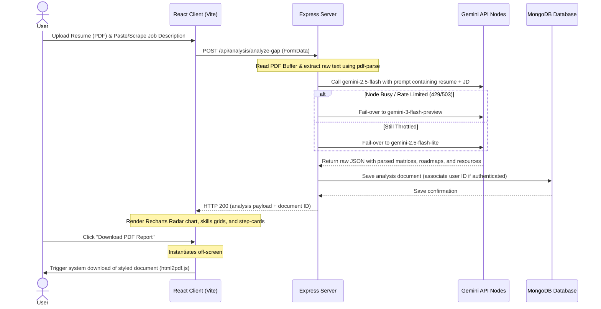

# <p align="center">BluePrint: AI Skill Gap Analyzer</p>

<p align="center">
  
  
  
  
  
</p>

---

## 🚀 Overview

**BluePrint** is a studio-grade career diagnostic platform designed to bridge the gap between academic profiles and industry requirements. Using advanced LLM orchestration and vector-based skill mapping, BluePrint analyzes your resume against any target Job Description to generate a high-fidelity **Analysis Matrix**, estimate **ATS Score compatibility**, list **matched and missing skills**, compile actionable **phased learning roadmaps**, and build a personalized **Knowledge Hub** with reference links.

The system features a **Self-Healing AI Node** pipeline to ensure high availability, an API-driven job requirement scraper powered by **Jina Reader**, and a pixel-perfect, off-screen **Shadow DOM PDF Export Engine** designed for exporting reports without breaking layout grids.

---

## 💎 Key Features

- **⚡ Vectorized Skill Diagnostic:** Real-time parity analysis mapping your resume's skills against target job descriptions.
- **🛡️ Self-Healing AI Engine:** Built-in multi-model failover protection (attempting `gemini-2.5-flash` → `gemini-3-flash-preview` → `gemini-2.5-flash-lite` fallbacks) ensuring high availability.
- **🎓 Knowledge Hub:** Dynamic extraction of targeted study resources (YouTube, GeeksforGeeks, LeetCode) directly correlating to detected skill gaps.
- **🗺️ Phased Roadmap:** Chronological step-by-step career pathing divided into actionable phases with durations.
- **📄 Shadow PDF Export:** High-fidelity, clean document generation using a hidden isolated DOM tree to prevent grid breaks.
- **🔗 Jina URL Scraper:** Direct integration allowing copy-pasting of career posting URLs to parse and isolate job specifications automatically.

---

## 🛠️ System Architecture & Data Flow

The diagram below outlines how the client handles uploads, how the backend parses files and manages model fallbacks, and how PDF printing is isolated.



### 💻 Technical Stack Details

| Layer | Technology | Version | Purpose |
| :--- | :--- | :--- | :--- |
| **Frontend** | React | `^19.2.4` | Component framework |
| **Frontend** | Vite | `^8.0.4` | Build tool & Dev server |
| **Frontend** | Framer Motion | `^12.38.0` | Motion layout transitions |
| **Frontend** | Recharts | `^3.8.1` | Radar diagnostic chart rendering |
| **Frontend** | Lucide React | `^1.8.0` | UI system icons |
| **Backend** | Express | `^5.2.1` | HTTP web server and API routing |
| **Backend** | Mongoose | `^9.4.1` | MongoDB Object Data Modeling (ODM) |
| **Backend** | JSON Web Token | `^9.0.3` | User session tokenization |
| **Backend** | Bcryptjs | `^3.0.3` | Password salting & hashing |
| **Backend** | PDF Parse | `^1.1.1` | Text extraction from uploaded files |
| **Backend** | Cheerio / Axios | `^1.2.0` / `^1.15.0` | Crawling fallback mechanism |
| **Backend** | Google GenAI | `^1.50.1` | Gemini LLM Node interactions |

---

## 📡 API Reference Guide

All backend routing is prefixed with `/api`. Protected routes expect a `Bearer <token>` payload in the HTTP Authorization headers.

### 🔑 Authentication Endpoints
`Prefix: /api/auth`

| Endpoint | Method | Access | Request Body | Success Response |
| :--- | :--- | :--- | :--- | :--- |
| `/register` | `POST` | Public | `{ "name": "Name", "email": "email@test.com", "password": "secure" }` | `{ "success": true, "_id": "...", "name": "Name", "email": "...", "token": "JWT" }` |
| `/login` | `POST` | Public | `{ "email": "email@test.com", "password": "secure" }` | `{ "success": true, "_id": "...", "name": "Name", "email": "...", "token": "JWT" }` |

### 📊 Analysis & Diagnostic Endpoints
`Prefix: /api/analysis`

| Endpoint | Method | Access | Request Body / Parameters | Success Response |
| :--- | :--- | :--- | :--- | :--- |
| `/analyze-gap` | `POST` | Public | `FormData` { `resume`: File, `jobDescription`: String, `userId`?: String } | `{ "success": true, "analysisId": "...", "data": { "matchPercentage": 75, "atsScore": 60, ... } }` |
| `/scrape-jd` | `POST` | Public | `{ "url": "https://careers.google.com/..." }` | `{ "success": true, "method": "Jina Reader", "text": "Cleaned JD details" }` |
| `/history` | `GET` | Private | *Header: Authorization: Bearer JWT* | `{ "success": true, "data": [ { analysis1 }, { analysis2 } ] }` |
| `/:id` | `GET` | Private | *Parameter:* `:id` (Analysis document ID) | `{ "success": true, "data": { analysisObj } }` |
| `/:id` | `DELETE` | Private | *Parameter:* `:id` (Analysis document ID) | `{ "success": true, "message": "Analysis removed" }` |

---

## 🗄️ Database Schemas

### 👤 1. User Model Schema

| Field | Data Type | Attributes | Description |
| :--- | :--- | :--- | :--- |
| `_id` | ObjectId | Auto-generated | Unique document identifier. |
| `name` | String | Required | Candidate's username. |
| `email` | String | Required, Unique, Regex Validated | Authenticated email address. |
| `password` | String | Required, Selected: False | Hashed password (using pre-save bcrypt hook). |
| `createdAt` | Date | Default: `Date.now` | Registration timestamp. |

### 📉 2. Analysis Model Schema

| Field | Data Type | Attributes | Description |
| :--- | :--- | :--- | :--- |
| `user` | ObjectId | Ref: `'User'`, Required: False | Associated user profile (enables guest analysis). |
| `jobDescription`| String | Required | Raw or scraped Job Description text. |
| `matchPercentage`| Number | Required | Core compatibility metric calculated by Gemini. |
| `atsScore` | Number | Default: `0` | Estimated compatibility with recruitment parsers. |
| `matchedSkills` | Array (Strings)| - | Matching skills detected in both resume and JD. |
| `missingSkills` | Array (Strings)| - | Critical gaps detected in candidate profile. |
| `recommendations`| Array (Strings)| - | Core strategic action points for interview preparation.|
| `resumeImprovements`| Array (Strings)| - | Structural or phrasing suggestions for the resume file.|
| `roadmap` | Array (Objects)| `step`, `task`, `duration` | Step-by-step milestones to cover skill gaps. |
| `learningResources`| Array (Objects)| `title`, `platform`, `url` | Tailored reference materials (YouTube, GFG, LeetCode).|
| `createdAt` | Date | Default: `Date.now` | Date of calculation. |

---

## ⚙️ Environment Variables

Create a file named `.env` in the `/server` root directory:

| Key | Example Value | Description |
| :--- | :--- | :--- |
| `PORT` | `5000` | Node server execution port. |
| `MONGO_URI` | `mongodb+srv://...` | Connection URI for the MongoDB instance. |
| `JWT_SECRET` | `your_jwt_secret_key` | Secret key used for encoding user authentication tokens. |
| `GEMINI_API_KEY` | `AIzaSy...` | Developer API key from Google AI Studio. |

---

## 📦 Directory Tree Structure

```text
BluePrint/
├── client/                     # React + Vite Frontend
│   ├── public/                 # Static public assets
│   ├── src/
│   │   ├── assets/             # Branding and icons
│   │   ├── components/         # Global components
│   │   │   └── Navbar.jsx             # Nav component
│   │   ├── pages/              # View pages
│   │   │   ├── History.jsx            # User history dashboard
│   │   │   ├── Home.jsx               # Analysis workbench & PDF generator
│   │   │   ├── Login.jsx              # Session login
│   │   │   ├── Register.jsx           # Session register
│   │   │   └── Welcome.jsx            # Dynamic landing page & responsive grid
│   │   ├── App.css             # Theme style variables
│   │   ├── App.jsx             # React routing & global settings
│   │   ├── config.js           # API route mapping
│   │   ├── index.css           # Modern brutalist grid systems & styles
│   │   └── main.jsx            # DOM renderer entrypoint
│   ├── package.json
│   └── vite.config.js
│
└── server/                     # Express Backend API
    ├── src/
    │   ├── controllers/        # Route controllers
    │   │   ├── auth.controller.js     # Auth routines
    │   │   └── analysis.controller.js # Ingestion, Scraper, & Gemini model fallbacks
    │   ├── middlewares/        # Express middleware chains
    │   │   ├── auth.middleware.js     # JWT route protection
    │   │   └── upload.js              # Multer memory buffering
    │   ├── models/             # Mongoose schemas
    │   │   ├── Analysis.js
    │   │   └── User.js
    │   ├── routes/             # Express routes endpoints
    │   │   ├── analysis.routes.js
    │   │   └── auth.routes.js
    │   ├── utils/              # Cryptography and token tools
    │   │   └── generateToken.js
    │   ├── app.js              # Express app declarations
    │   └── server.js           # Database connections and bootstrap
    ├── package.json
    └── .env
```

---

## 🚀 Setup & Installation

### 1. Prerequisites
- **Node.js** (v18.x or above recommended)
- **MongoDB** (Local instance or MongoDB Atlas cluster)
- **Google Gemini API Key** (Obtained from Google AI Studio)

### 2. Clone the Codebase
```bash
git clone https://github.com/yash-kumarsharma/BluePrint.git
cd BluePrint
```

### 3. Server Deployment (Backend)
```bash
cd server
npm install

# Create server/.env file and fill in parameters
# Run Development Server:
npm run dev
```

### 4. Client Deployment (Frontend)
```bash
cd ../client
npm install

# Run Development Server:
npm run dev
```

---

## 🎯 Project Roadmap

- [x] **V1.0**: Core MERN setup, raw document text extraction.
- [x] **V1.5**: Brutalist typography, dynamic Recharts Radar diagnostics.
- [x] **V2.0**: Off-screen Shadow DOM print layouts, web scraper.
- [x] **V2.1**: Mobile-responsive viewport configurations and flexible grids.
- [ ] **V2.5**: Shared team analysis workspaces, GitHub repository coding scans, and multi-file processing.

---

## 📄 License

This project is licensed under the MIT License - see the [LICENSE](LICENSE) file for details.

---

## 👨‍💻 Author

**Built with ❤️ and 💻 by:**

[](https://github.com/yash-kumarsharma)

---
